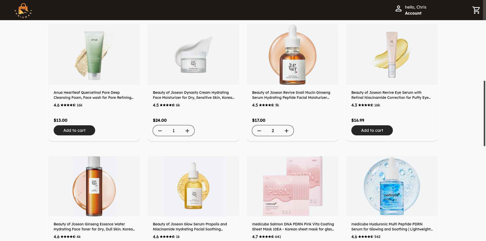
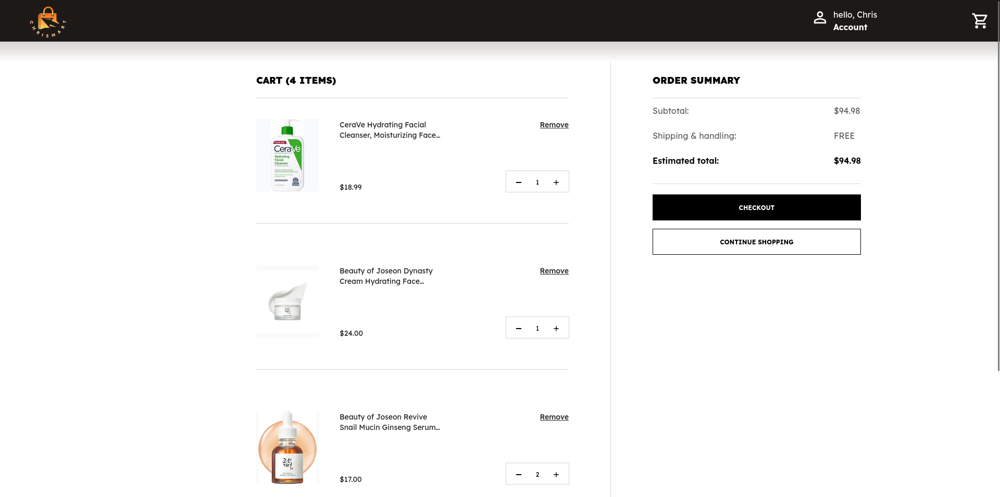
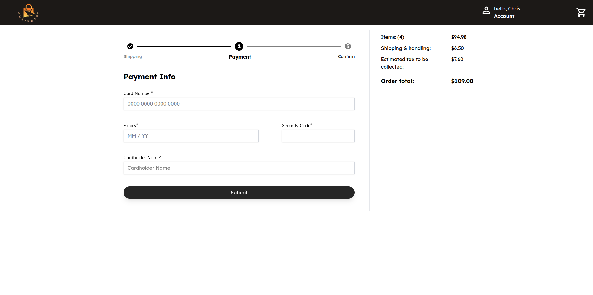
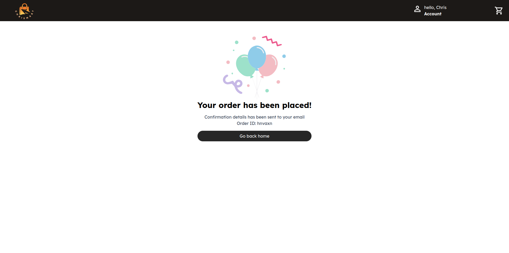

# E-Commerce Platform

Full-stack e-commerce platform with user authentication, shopping cart, and checkout flow.

🔗 **[Live Demo](https://ecommerce-web-sze7.vercel.app/)**


## Screenshots
 

 


https://github.com/user-attachments/assets/72369092-ac89-4764-9e67-655afde6f01b

## Features

- User authentication (signup/login with JWT)
- Product catalog with images and ratings
- Shopping cart (add/update/remove items)
- Multi-step checkout process
- Order confirmation

## Tech Stack

**Frontend:** Next.js 14, React, TypeScript, Tailwind CSS

**Backend:** Express, Node.js, JWT authentication

**Database:** PostgreSQL with Prisma ORM

**DevOps:** Docker, Docker Compose, Vercel, Railway


## Architecture
```
┌─────────────┐
│   Vercel    │  Frontend (Next.js)
└──────┬──────┘
       │
┌──────▼──────┐
│   Railway   │  Backend (Express + PostgreSQL)
└─────────────┘
```

### Installation

1. Clone the repository
```bash
git clone https://github.com/chrispool999/ecommerce
cd ecommerce
```

2. Set up environment variables and seed db
```bash
cp .env.example .env
# Edit .env with your values
cd api
npx prisma db seed
```

3. Start with Docker
```bash
docker-compose up
```

4. Access the application
- Frontend: http://localhost:3000
- Backend: http://localhost:5000

## Database Schema

Key relationships:
- Users → Orders (one-to-many)
- Orders → OrderItems → Products
- Users → CartItems → Products

## API Endpoints

**Auth:**
- `POST /auth/signup` - Create new user
- `POST /auth/login` - Login user

**Products:**
- `GET /products` - Get all products

**Cart:**
- `GET /cart` - Get user's cart
- `POST /cart` - Add/update item
- `DELETE /cart/:productId` - Remove item

**Orders:**
- `POST /orders` - Create order from cart

## Future Improvements

- [ ] Implement responsive design
- [ ] Payment integration (Stripe)
- [ ] Tests
- [ ] CI/CD (GitHub Actions)
- [ ] Caching (Redis)
- [ ] Performance Benchmarking
- [ ] Product search and filtering
